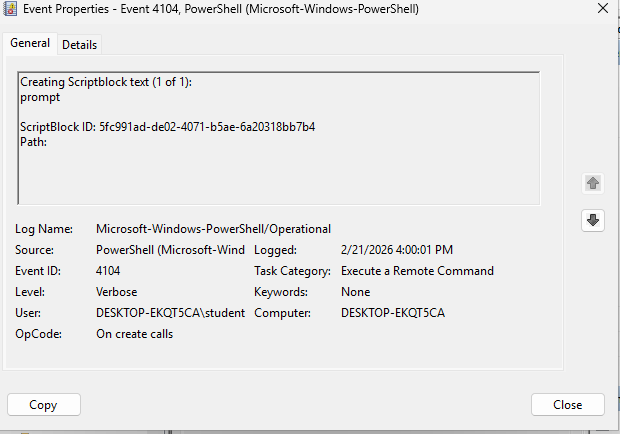
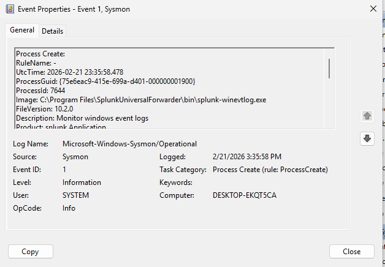
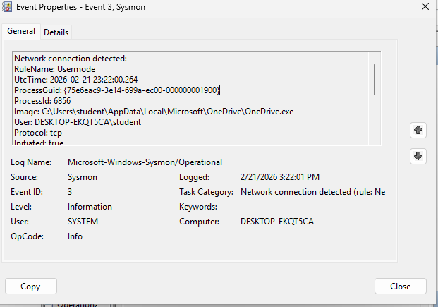
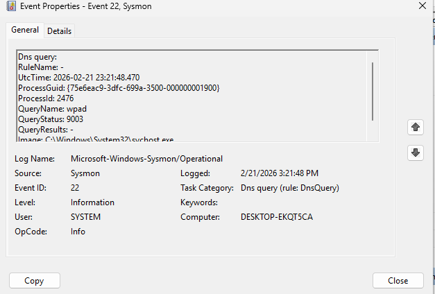

\# SOC Lab – Splunk \& Sysmon Telemetry Validation

\## Project Overview

This project demonstrates the successful build and validation of a Security Operations (SOC) lab environment using:

\- Windows 11 VM

\- Sysmon

\- PowerShell Script Block Logging (Event ID 4104)

\- Splunk Enterprise

\- Docker (Ubuntu Server)

\- VirtualBox

The objective of this lab was to validate telemetry visibility between endpoint logging and SIEM ingestion.

---

\## Tools \& Technologies

\- Splunk Enterprise (Docker deployment)

\- Sysmon

\- Windows Event Viewer

\- PowerShell Logging (Operational Log)

\- Ubuntu Server

\- Docker

\- VirtualBox

---

\## Telemetry Validated

The following event types were successfully generated and verified:

\- Sysmon Event ID 1 – Process Creation

\- Sysmon Event ID 3 – Network Connection

\- Sysmon Event ID 22 – DNS Query

\- PowerShell Event ID 4104 – Script Block Logging

These logs confirm endpoint visibility necessary for threat detection use cases.

---

## Screenshots

### PowerShell Script Block Logging (Event ID 4104)

### Sysmon Event ID 1 – Process Creation

### Sysmon Event ID 3 – Network Connection

### Sysmon Event ID 22 – DNS Query

---

\## Skills Demonstrated

\- SIEM Deployment (Splunk via Docker)

\- Endpoint Telemetry Configuration

\- Windows Logging Validation

\- Sysmon Configuration

\- Log Source Verification

\- SOC Lab Architecture Design

---

\## Next Phase

This lab will be expanded to include:

\- Attack simulation scenarios

\- MITRE ATT\&CK mapping

\- Detection query development

\- Incident analysis documentation

---

Author: Douglas Darrell  

U.S. Army Veteran | Cybersecurity Analyst

